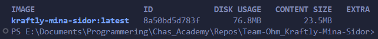

# Containers

## Hur man kör

```bash
# Från repo-roten
docker compose up --build
```

- Frontend: http://localhost:8080
- API: http://localhost:4000

## Storlekstabell

| Image                                               | Storlek (DISK USAGE) |
| --------------------------------------------------- | -------------------- |
| kraftly-mina-sidor (multi-stage, nginx:1.24-alpine) | 76.8 MB              |
| Naiv image (med Node + dist)                        | 250+ MB              |

_Skärmdump:_


## Tre beslut

1. **Basimage**: nginx:1.24-alpine (lättvikt, 64.4 MB basstorlek)
2. **Mock-API**: Körs som separat service i docker-compose med Node:22-alpine
3. **Browser -> API**: Anropar /api relativt, nginx proxar till http://api:4000 (servicename i docker-compose)

## Vad som körs i CI

- `docker build` som eget jobb i GitHub Actions
- Loggarens storlek skrivs ut i build-loggen
- Verifierar att imagen är < 100 MB

## Kända begränsningar

- Testad på Windows med Docker Desktop
- Kräver Docker Desktop igång för att bygga lokalt
